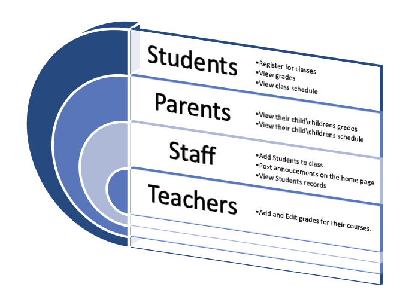

<h1>Welcome to the SFSeniorProject2021Group3</h1>

<h2>Project Name: School Registration System</h2>

<h2>Mission Statement:</h2>

We are given students, parents, staff, and teachers a registration platform. This platform will allow parents to check their children\children's grades, Students will be able to view grades, register for class, and view schedule. Staff will be able to view student data and schedule but will not be able to edit. Teachers will be able add grades and add and drop students. Teachers will only be able to edit grades for their courses. Teachers will also be able to keep track of attendance. * We may or may not have some kind of messaging system for teachers, parents, or students.
  

<h2>Features:</h2>

User registration  
Roles for Staff, Parents, Students, and Teachers  
Staff will be able to add/drop students from own classes, view own student data, and student schedule  
Students will be able to view their own schedule, grades, and register for classes  
Parents will be able to view their own student schedule and grades.  
Teachers will be able to edit grades, view schedules, create student data for corresponding courses, view student data. Teacher  
will be able to see corresponding parent
   

<h2>The Team</h2> 
<table style="width:100%">
  <tr>
    <td>Jill</td>
    <td>Smith</td>
    <td></td>
  </tr>
  <tr>
    <td>Eve</td>
    <td>Jackson</td>
    <td></td>
  </tr>
  <tr>
    <td>Test</td>
    <td>user</td>
    <td></td>
  </tr>
    <tr>
    <td>Test</td>
    <td>user</td>
    <td></td>
  </tr>
</table>

 

<h2>Contributors:</h2> 

Chris Evers  
Dustin Cox  
Lauren Cameron  
Phillip Hernandez
  

<h2>Teachers & TAs:</h2> 

Michael Buchholz 
Mari Jayne Frederick 
James Nichols 
Debbie Reid
 

OOP: Java 
DB: MYSQL
 

<b>Project Management:</b>Asana  
<b>Project Communication:</b> Slack and Canvas 
 

<h2>Phase 1 -  Project Analysis Phase</h2> 

Lead: Phillip Hernandez 
Recorder: Dustin Cox 
Coordinator: Chris Evers 
Member (Researcher): Lauren Cameron
 

<h2>Phase 2 - Project Architecture</h2 

Lead: Lauren Cameron 
Recorder: Chris Evers 
Coordinator: Phillip Hernandez 
Member (Researcher): Dustin Cox
 

<h2>Phase 3 - Development</h2> 

Lead: Dustin Cox 
Recorder: Phillip Hernandez 
Coordinator: Lauren Cameron 
Member (Researcher): Chris Evers
 

<h2>Phase 4 - Implementation and Testing</h2> 

Lead: Phillip Hernandez 
Recorder: Dustin Cox 
Coordinator: Chris Evers 
Member (Researcher): Lauren Cameron
 

<h2>Phase 5 - Software Update and Marketing Plans</h2> 

Lead: Dustin Cox 
Recorder: Lauren Cameron 
Coordinator: Phillip Hernandez 
Member (Researcher): Chris Evers
 

<h2>User Types and Roles</h2>

